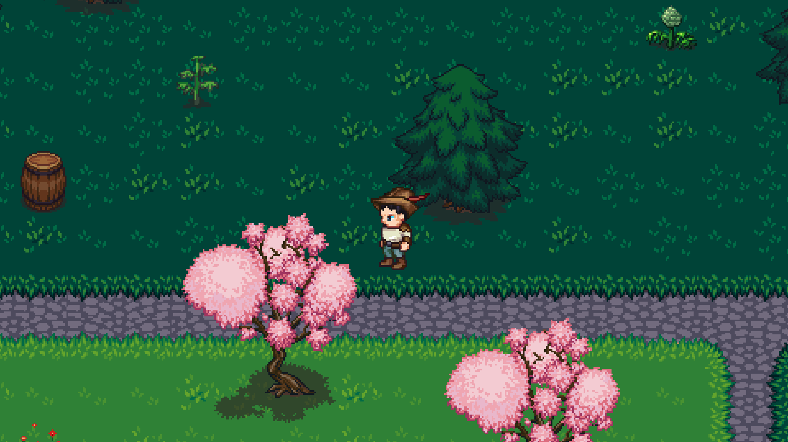
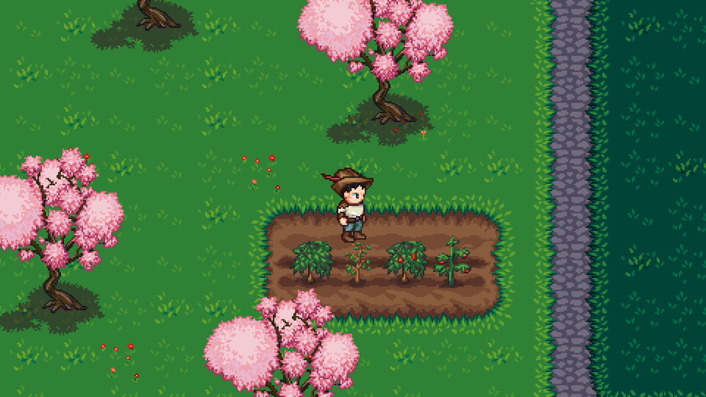

# Wanderer    

An exploration based 2D game that is currently in development. The game isn't yet ready to be installed and played.

  
   

## Installation

N/A

## Acknowledgements

- [SimpleVoxelEngine (James Randall)](https://github.com/JamesRandall/SimpleVoxelEngine) The game makes use of an adapted version of the AABB tree written by James Randall for the Simple Voxel Engine project.
- [Theo Wiik](https://github.com/theowiik) Helped with feedback and ideas.
- [Oscar Almström](https://github.com/oscaralmstrom) Helped with feedback and ideas.